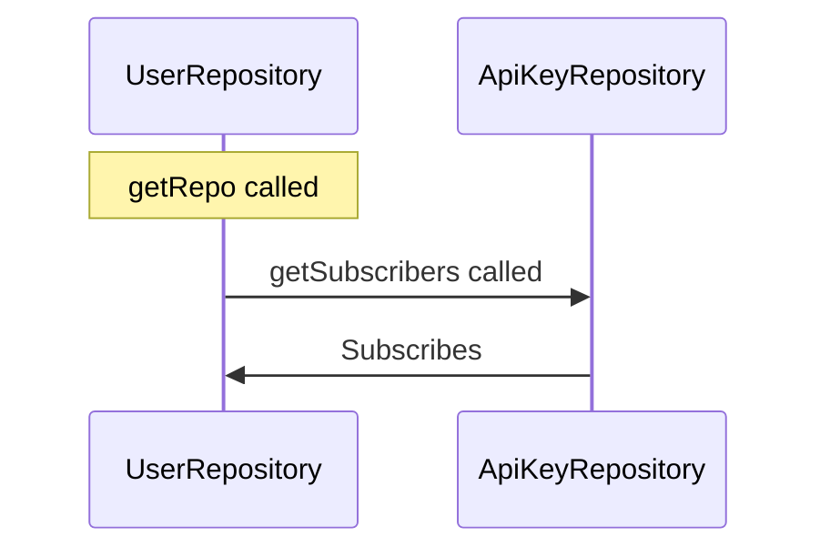

# Personal Backend Database Library

This is used to actually interact with databases in personal projects.

## Development

### Creating a new Repository

1. Copy an existing one over
2. Make sure to register the repository in the `RepoSubscriptionService`, even if nothing needs to be setup, just as a future precaution.

## Subscription System

## Schema Validation for DB

If any of the base document types are updated, make sure to run `yarn validate`
to make sure that the DB is up-to-date as well.

## Manual Database Operations

Go ahead and run these as code in a test in the BaseRepository.spec.ts file.

## Dependencies

- [`core-ts-db-lib`](https://github.com/aneuhold/core-ts-db-lib)
