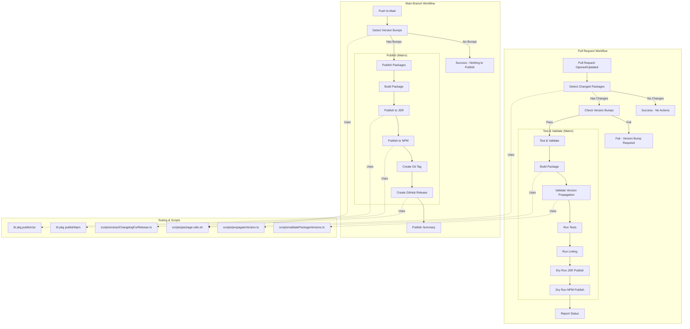

# CI/CD Build Process

This document outlines the Continuous Integration and Continuous Deployment (CI/CD) process for the `ts-libs` monorepo. The process is automated using GitHub Actions and relies on a combination of local scripts and the `@aneuhold/main-scripts` toolset.

## Overview

The build process is divided into two main workflows:

1.  **Pull Request Workflow:** Focuses on validation, testing, and ensuring version bumps are present for changed packages.
2.  **Main Branch Workflow:** Focuses on publishing packages that have been version-bumped and creating releases.

## Workflow Diagram

[Link to Diagram in Mermaid Live](https://mermaid.live/edit#pako:eNqFVl1P2zAU_SuWH9Am0QINLTQPk0YZQ2hlVVuYtLQPbmKSqGmc-WODAf9913aSOmlheUh8nXOO7etznTzjkEUU-zjmpEjQ_HKRI7iEWtmOBZ6oLENT-ktRIdEPxtcPGfuzwBanr8k0aGC-FzSn0dFdERFJoyXqdD6hSyppKEcJyWMqAhshG0ZoQsI1gf7lVrOB1wovt6zEixcYcabCkAoRlE_UQfD-cyhTlr8vc03EVueecgGMUULDdWDuVRe6UJvCVXKhRuiKpJmeiX4G-gZzcMkmHSmHBLwjMiECpjGHrN2TLNX5CnSADlAVA3vLd3alBUMfxkTy9PGjuzH6crXNTlyoNIsCc68Sv2xS7DuNnXBWkJjIOke1UrVSB9FSaXONoJ5NMFW5aYjl7lQN6luaW5RupHncwuleayr-BKib2TSAFtIEaKOJWmWpSFqkGuswbyfjmgntPUyaR27-a5rNznQmiVQimNKCcYlsVLIdprNrY5KCOzjJw2R_KSmRBPqGJEMa7FaPsWRVO2_51IFWZWOCFyO3r2xkAinW4-0uvy2mi6dUK8HWdUEZuZW817UV7i23NlS3doXu_zsWQHZb1EpbohoKFgbhcmecygrQ1D5w4BDuwqtN_5rKOYmDEae6DCBCELbgFmPh11OaUSKow7iGiZa9b1utJhqZmdpsCH-qZ1nG73ptzlimd_YAzUKeFlK4yW4djF0Y4-VOmLN1Hd_JNBOBsKyjwqa8o3Rv921_7NFwjW0T7oDmF4FcoWIdo8Ku6kbwZYNhct5g9FqU22Kz3Jszh_XlUXICa_1Wr4iWPWb1GYuvGC-J3cahtHuEuWu8r_V-l6diac6yNEVTrDxVGwq9bZLLoSrylgubiw_h65xG2Jdc0UO8oXxDdIifNWSBZUI3dIF9aEaEr_U-vwKnIPlPxjYVjTMVJ9h_IJmASJmv82VKwC5bCAxG-YipXGJ_0B8aDew_40fsd3png25_4J14vdOT8-O-Nzg7xE_Yh3b3fOgNz48HA8_zTofe6yH-a8Y9gRf9095xf9g78byhdwyCNEol42P7z2F-PV7_ASM7so8)

### Key Components & Notes

1.  **`scripts/package-utils.sh`**: This is the core logic for detecting changes.
    - **PRs**: It compares `HEAD` against `origin/main` to find changed packages. It also verifies that `package.json` version in the PR is different from `main`.
    - **Main Branch**: It compares `HEAD` against the previous commit (`HEAD~1`) to detect which packages had their versions bumped in the merged PR.

2.  **`tb` (from `@aneuhold/main-scripts`)**:
    - The `tb` CLI tool is used within the package scripts (e.g., `pnpm jsr:publish`, `pnpm npm:publish`).
    - It handles the complexity of publishing to different registries and ensures consistency.
    - It is implemented in the `core-ts-lib` package within this monorepo but consumed via the `main-scripts` CLI.

3.  **Validation Steps**:
    - **JSR & NPM Dry Runs**: The PR workflow performs a "dry run" of the publish command. This ensures that the package is valid, dependencies are resolvable, and it _would_ publish successfully if merged.

4.  **Releases**:
    - GitHub Releases are automatically created for published packages.
    - The release notes are extracted from the `CHANGELOG.md` using `scripts/extractChangelogForRelease.ts`.

5.  **Local Registry**:
    - The CI process does _not_ use the local registry (`local-npm`). It uses the real NPM and JSR registries (or their dry-run equivalents).
