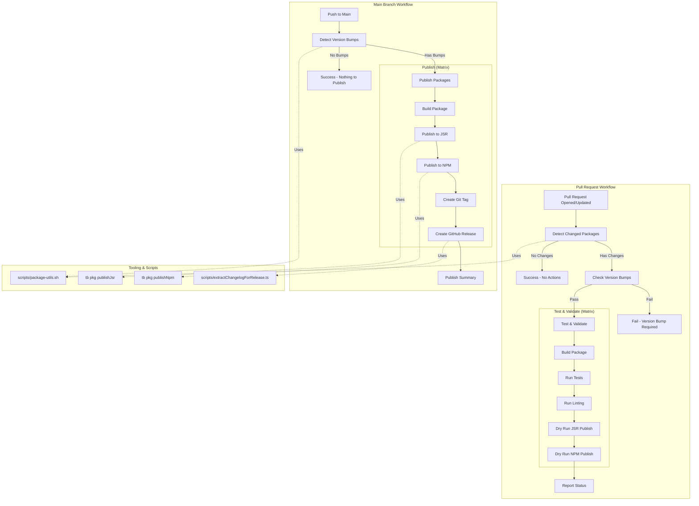

# CI/CD Build Process

This document outlines the Continuous Integration and Continuous Deployment (CI/CD) process for the `ts-libs` monorepo. The process is automated using GitHub Actions and relies on a combination of local scripts and the `@aneuhold/main-scripts` toolset.

## Overview

The build process is divided into two main workflows:

1.  **Pull Request Workflow:** Focuses on validation, testing, and ensuring version bumps are present for changed packages.
2.  **Main Branch Workflow:** Focuses on publishing packages that have been version-bumped and creating releases.

## Workflow Diagram

[Link to Diagram in Mermaid Live](https://mermaid.live/edit#pako:eNqFVV1P2zAU_SuWH9AmtSUNLS15mDTKGELAqrYwaWkf3MQkUfM1fwgY5b_v2k5atw3gB8fXOefYvvc4ecVBEVLs4YiRMkazi3mOoHG5NBNzPJZpiib0r6RcoN8FWz2mxdMcG5xq44m_g_lV0pyGx_dlSAQNF6jd_oYuqKCBGMUkjyj3TYRMGKIxCVYE5hdbzR28UljfFRWer2HFqQwCyrlfPVEbwfvvgUiK_GOZK8K3Og-UcWCMYhqsfN3XU-hcZqWtZEO10CVJUrUT9fRVB3uwyTodCYMEfCAyJhy2MYOsPZA0UfnyVYCOUB1b7O3Iqs4eHH25JYIlz1_tAqlmr6Erci6TNPR1XxdgsUsx7xRWkf2JzPWALw6VNeomyQ1KDZI82sOpWeMF9gKo6-nEhxFSBBijsVymCY_3SBusxbwb326YMG5g0jxsStuGrsXARIIIyf0JLQsmkIkqFa1wcBVuSQLFZSQP4uabIHnsqw6JAimwbX7tqNr679nMgtau18FayzW5XsSQarXeYRr2xZT3K7UKbMziV1HTRWw0XY1_z2w76lu3wfTnhgOQKY9cKovUS8EBIVwcrFNbA4bKFxYcwkN4XfyfiZiRyB8xqu4DRAjCPbjBGPjVhKaUcGoxrmCj1ezn1tsIaLmpzDLCXja7reIPvTcrilRV-ghNA5aUgttJ3_vOdWCN9T3Xn8pVdC-SlPvcsI5Lk_q2VLOd9_3SoGEb3STeAs3OfbFE5SpCpTnVNWeLHYbO_Q7D3aPcldmiMWcW68ezYATOerM5Ea1m9OnTIrosWEXsCOs-4xb845IQe4JJ2sIZZRlRIX5VkDkWMc3oHHswDAlbqfS-Aack-Z-iyGoaK2QUY--RpBwiqf9xFwmBKm0hsBhlo0LmAnt9t6s1sPeKn7HXHji9zknvpHvac5z-cOD2W_gFe11n2HEG3WHfdbuuczZwhm8t_E8v63a6_bNTt9vrD6D1Hff07T_qsmVP)

### Key Components & Notes

1.  **`scripts/package-utils.sh`**: This is the core logic for detecting changes.
    - **PRs**: It compares `HEAD` against `origin/main` to find changed packages. It also verifies that `package.json` version in the PR is different from `main`.
    - **Main Branch**: It compares `HEAD` against the previous commit (`HEAD~1`) to detect which packages had their versions bumped in the merged PR.

2.  **`tb` (from `@aneuhold/main-scripts`)**:
    - The `tb` CLI tool is used within the package scripts (e.g., `pnpm jsr:publish`, `pnpm npm:publish`).
    - It handles the complexity of publishing to different registries and ensures consistency.
    - It is implemented in the `core-ts-lib` package within this monorepo but consumed via the `main-scripts` CLI.

3.  **Validation Steps**:
    - **JSR & NPM Dry Runs**: The PR workflow performs a "dry run" of the publish command. This ensures that the package is valid, dependencies are resolvable, and it _would_ publish successfully if merged.

4.  **Releases**:
    - GitHub Releases are automatically created for published packages.
    - The release notes are extracted from the `CHANGELOG.md` using `scripts/extractChangelogForRelease.ts`.

5.  **Local Registry**:
    - The CI process does _not_ use the local registry (`local-npm`). It uses the real NPM and JSR registries (or their dry-run equivalents).
