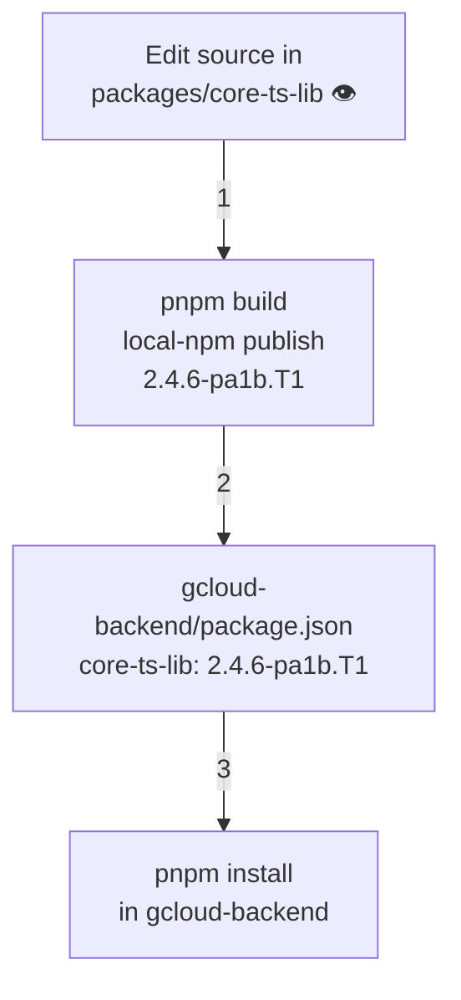
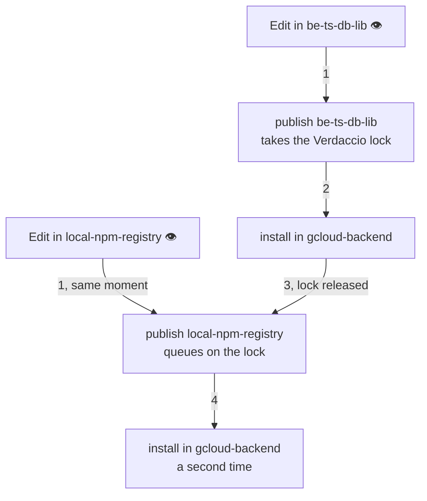
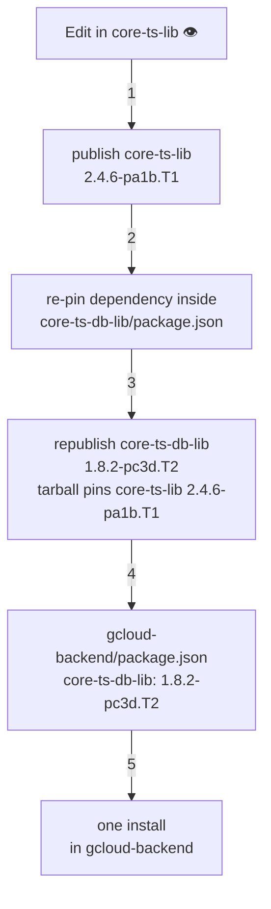
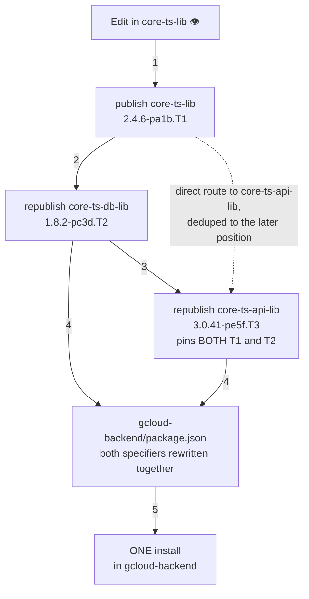
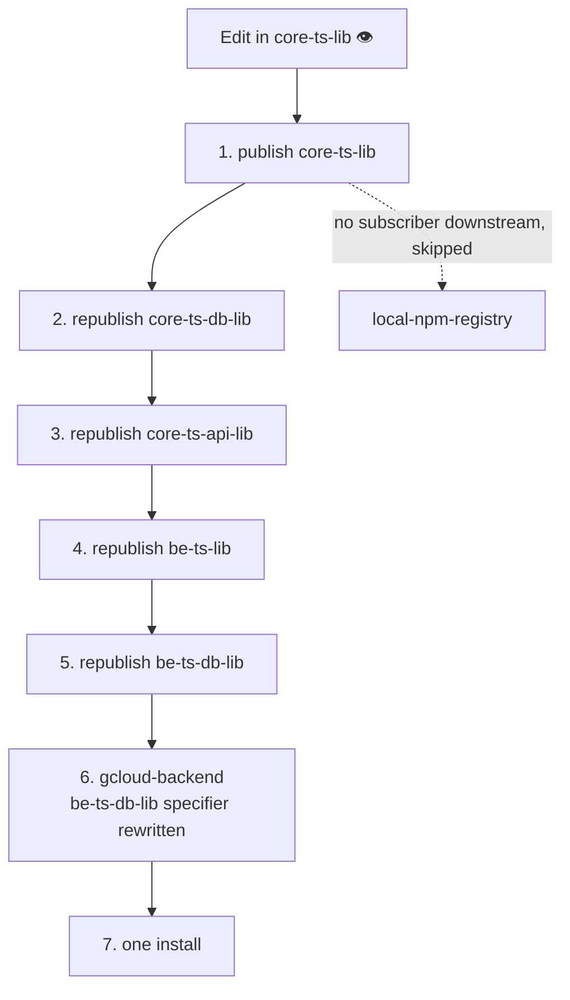
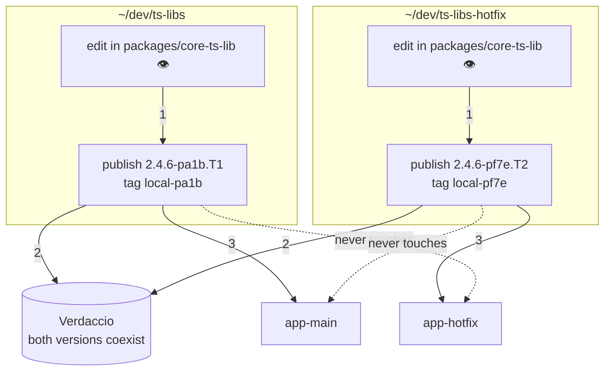

# Scenarios, simplest to most complex

How the proposed system behaves, one new idea per scenario. Each one adds exactly one thing the
previous one did not have.

Dependency edges come from each publishing package's `dependencies`, read at publish time rather than
declared, so [subscriptions are for consumers](./local-npm-registry-hardening.md) and none of the
scenarios below has one inside the monorepo.

A package has to publish once before anything can subscribe to it or the graph can reach it, which is
what the watcher in its own folder does at startup. That is why the watcher lists grow faster than
the subscriptions do.

Versions are abbreviated. `2.4.6-pa1b.T1` stands for `2.4.6-pa1b2c3d4.20250726123456789`, where
`pa1b2c3d4` is the slug of the publishing directory's path and the trailing number is a timestamp.

👁 marks a folder with a watcher running in it.

## 1. One package, one consumer

**Watcher in:** `packages/core-ts-lib`

**Subscription,** from inside `gcloud-backend`:

```bash
local-npm subscribe @aneuhold/core-ts-lib
```



The baseline. One publish, one specifier rewrite, one install. The walk stops at `core-ts-lib`
because no other package reaches a subscriber.

## 2. Two watchers, two processes

**New here:** a second watcher, so a second OS process with no view of the first.

**Watchers in:** `packages/be-ts-db-lib` and `packages/local-npm-registry`, the two packages nothing
depends on, so neither edit cascades and the scenario isolates the process question on its own

**Subscriptions,** both from inside `gcloud-backend`:

```bash
local-npm subscribe @aneuhold/be-ts-db-lib
local-npm subscribe @aneuhold/local-npm-registry
```



Two edits at one moment produce **two full installs** in one consumer, back to back. They cannot
overlap, since each publish holds the lock across its own install, so this is throughput cost rather
than corruption risk. Nothing coalesces them: separate processes cannot see each other's work.

## 3. The edit lands in a package nobody subscribed to

**New here:** the cascade.

**Watchers in:** `packages/core-ts-lib` and `packages/core-ts-db-lib`

**Subscription,** from inside `gcloud-backend`, naming a package that is not the one being edited:

```bash
local-npm subscribe @aneuhold/core-ts-db-lib
```



`gcloud-backend` never subscribed to `core-ts-lib` and never gets a specifier for it. The new code
arrives transitively, because step 3 packs a **new** `core-ts-db-lib` whose tarball points at what
step 1 produced.

`core-ts-db-lib` needs a watcher only so that it publishes once and becomes reachable. It needs no
subscription of its own, and it is a dependent purely because its package.json says so. Nothing edits
it here, so its watcher stays idle and step 3 re-pins and repacks it without rebuilding it.

## 4. One package reached two ways

**New here:** deduplication. `core-ts-api-lib` depends on `core-ts-lib` directly **and** through
`core-ts-db-lib`, so the walk arrives at it twice.

**Watchers in:** `packages/core-ts-lib`, `packages/core-ts-db-lib`, and `packages/core-ts-api-lib`

**Subscriptions,** both from inside `gcloud-backend`:

```bash
local-npm subscribe @aneuhold/core-ts-db-lib
local-npm subscribe @aneuhold/core-ts-api-lib
```



`core-ts-api-lib` is reached twice but published **once**, after both of its dependencies, so its
tarball and `gcloud-backend`'s two specifiers name the same versions rather than two different ones.
The consumer also gets **one** install at the end instead of one per level, which is the coalescing
scenario 2 could not do across processes and this one can, because it is all a single command.

## 5. Full depth, where order and pruning both matter

**New here:** topological ordering across the longest real chain, and dropping a dependent that no
subscriber can reach.

**Watchers in:** every package, which is what `pnpm watch` at the monorepo root starts

**Subscription,** from inside `gcloud-backend`, naming only the far end of the chain:

```bash
local-npm subscribe @aneuhold/be-ts-db-lib
```



Each republish must happen **after** everything it depends on has its new version, or its tarball
captures the old one. Depth is what makes a topological walk necessary rather than a list.

All seven steps run inside the single `local-npm publish` that `core-ts-lib`'s watcher started. That
one process derives the graph, sorts it, and packs the other four by writing into their folders, so
the five other watchers stay idle throughout and none of them is notified.

`local-npm-registry` depends on `core-ts-lib` and is a genuine dependent, but nothing subscribes to
it and nothing depends on it through `dependencies`, so the walk drops it. That leaves five publishes
before the install starts, roughly 1.9 seconds of packing at ~370ms each, for one keystroke.

## 6. Two copies of ts-libs publishing at once

**New here:** one package name published from two directories. This is a separate axis from the
cascade, and composes with all of the above.

**Watchers in:** `~/dev/ts-libs/packages/core-ts-lib` and `~/dev/ts-libs-hotfix/packages/core-ts-lib`

**Subscriptions,** each from inside its own consumer, and each naming a directory because the package
name alone is now ambiguous:

```bash
# from inside app-main
local-npm subscribe @aneuhold/core-ts-lib --path ~/dev/ts-libs/packages/core-ts-lib

# from inside app-hotfix
local-npm subscribe @aneuhold/core-ts-lib --path ~/dev/ts-libs-hotfix/packages/core-ts-lib
```



Each directory gets its own slug, version namespace, and subscriber list. A publish updates
only the consumers bound to the directory it ran from, and pruning removes only that directory's old
versions.

The two publishes still serialize on the Verdaccio lock, so the second waits rather than failing, but
neither can overwrite or delete what the other produced. Each also runs its own cascade, over its own
copy of the graph, resolved to its own publishing directory by
[segment-wise path matching](./local-npm-registry-hardening.md).
