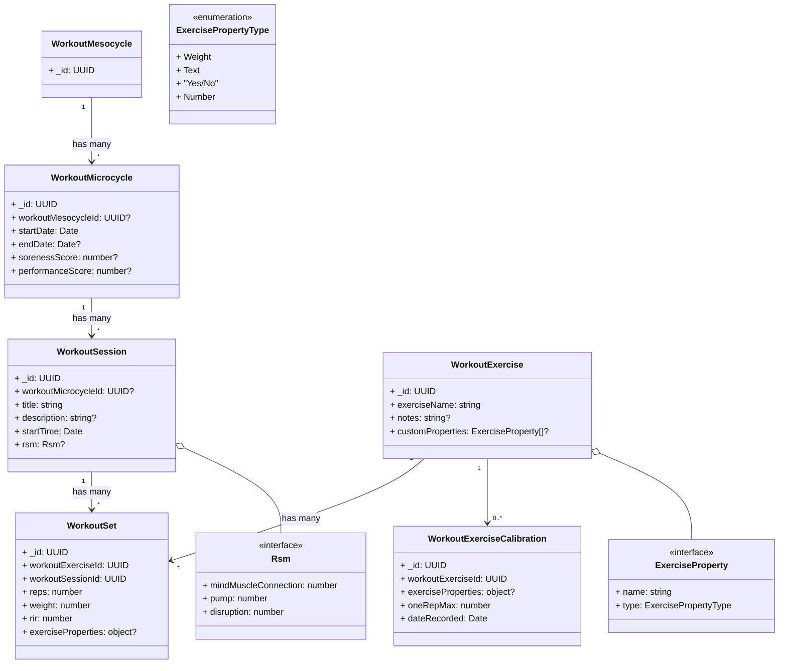
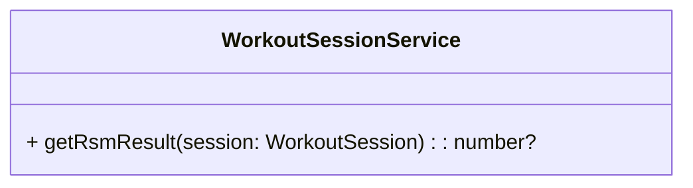

# Dashboard Workouts Domain Model

## Document Diagram

> Note: Where an interface is defined, that is meant to be an embedded definition of the class that defines it. This is a limitation of mermaid, so imagine every interface is just an embedded object definition.

Model Notes:

- `exerciseProperties` in `WorkoutSet` and `WorkoutExerciseCalibration` are populated from `WorkoutExercise.customProperties` at creation time. Then whenever customProperties are changed, they are changed among every single existing WorkoutSet with that WorkoutExercise linked to it.

## Service Diagram

Service Notes:

- There will likely be a method or set of methods that create a schedule projection based on the mesocycle.

## Terms

- **Stimulus**: Stimulus is generally the amount of stress we are applying to a muscle over a particular time frame.

- **Effective Stimulus Range** (pg 28-29): The effective stimulus range is the range between very low stimulus, and just after the amount of stimulus that causes peak muscle growth, just where more stimulus would start resulting in muscle loss.
- **Cell Swelling** (pg 26): "The Pump" 💪
- **Relative Effort** (pg 23): Relative Effort is a measure of how close to failure you are on a lift or how difficult the lift is for you with respect to your current capacity.
- **Reps in Reserve (RIR)** (pg 30): Reps in Reserve are the set's proximity to muscle failure. In other words, how many reps do you have left before you completely fail to produce the movement.
- **Effective Sets** (pg 33): Effective sets are a set that is done within 5-30 reps, and within 0-5 RIR.
- **Volume** (pg 34+): From page 34 and onwards, the book discusses volume as the number of effective sets. Even though this isn't the technical definition, everything averages out as long as you are using effective sets.
- **Minimum Effective Volume (MEV)** (pg. 34): The minimum volume which leads to muscle growth. This varies by age, training experience, and existing muscle mass. As you get stronger / bigger, this gets higher.
- **Maximum Recoverable Volume (MRV)** (pg. 34): The maximum volume that can be done before muscle loss begins.
- **Microcycle**: The shortest cycle of training that includes all workout sessions and rest days and is repeated. Typically, but not always, this is a week.
- **Mesocycle**: An organized sequence of microcycles ordered to elicit a set of distinct training adaptations. The typical mesocycle is composed of two distinct phases: an accumulation phase, and a shorter deload phase.

## Key Concepts

### Training Stimulators (pg. 19-20)

The key stimulators at the cellular level that occur in response to training and are predictive of hypertrophy are:

- Tension
- Metabolite Accumulation
- Cell Swelling

During training, and while designing a program, we focus on the following stimulators, in order of importance, in order to cause the above 3 in the optimal way:

1. Tension
2. Volume
3. Relative Effort
4. Range of Motion (ROM)
5. Metabolite Accumulation
6. Cell Swelling
7. Mind-Muscle Connection
8. Movement Velocity
9. Muscle Damage

### Effective Reps (pg. 30-32)

The number of "effective reps" you have done are the number of reps between 5 RIR and 0 RIR. So if you got to 0 RIR, then you did 5 "effective reps". This is not to say that reps before 5 RIR are not useful, they are, just less so.

The catch to this is that lower RIR is much more fatigue, and in the grand scheme of things, always going to 0 RIR can cause muscle loss. So a more balanced average of 2-3 RIR is best.

Further, notable growth happens between 30% 1RM and 85% 1RM per repetition. Any less, doesn't give enough stimulus, any more and fatigue + injury risk increase exponentially. Note this is <u>per rep</u>, which means you must keep hitting that weight throughout the set. See the book for a further analysis, but this seems like the most key takeaway.

See Effective Sets for more info.

### Effective Sets (pg. 33)

Effective sets, are an extension of the effective reps, and basically widen the view a bit more. If only taking effective reps into account, one could conclude that a set with 2 RIR and one with 3 RIR is the same as one with 0 RIR. But that doesn't include the reps that were done before the effective reps. So overall the two sets will confer about twice the growth. More sets is virtually always better if they fit the parameters above and have at least 1 effective rep.

Sets anywhere between 5 - 30 reps are great, as long as they have at least 1 effective rep. Note that for mind-muscle connection, 10 - 20 reps is normally ideal for most people. Too little and you are straining too much too focus, too much and fatigue comes in which also doesn't help with focus.

If you are trying to hit a target rep range of 10-20, and start at 16, 14, 12, 10, but need to add a fifth set the next week, it will need to be a drop set. So go down a bit of weight on the fifth set in order to keep your target reps of 10. (pg. 62)

Because of the averages and guidelines (roughly 2-3 RIR per set, and 5 - 30 reps per set), you can generally judge any workout program by the number effective sets in this way.

### Checklist between Sets (pg. 39)

- Are my pecs still burning from the last set?
- Are my front delts and triceps ready to support my chest in another set?
- Do I feel mentally and physically like I can push hard with my chest again?
- Is my breathing more or less back to normal?

If you can answer yes on the recovery side for all of these, then you are good to go.

### Raw Stimulus Magnitude (RSM) (pg. 50-53)

RSM is the amount of muscle growth stimulus any given Workout Session gives. It is very well proxied by some combination of mind-muscle connection, pump, and disruption.

The following questions can quantify RSM for a given workout session, the results of which are valuable and can be used in various ways:

#### Mind Muscle Connection

On a scale of 0-3 how much did the training challenge your target muscles?

- 0: You felt barely aware of your target muscles during the exercise
- 1: You felt like your target muscles worked, but mildly
- 2: You felt a good amount of tension and/or burn in the target muscles
- 3: You felt tension and burn close to the limit in your target muscles

#### The Pump

On a scale of 0-3 how much pump did you experience in the target muscles?

- 0: You got no pump at all in the target muscles
- 1: You got a very mild pump in the target muscles
- 2: You got a decent pump in the target muscles
- 3: You got close to maximal pump in the target muscles

#### Muscle Disruption

On a scale of 0-3 how much did the training disrupt your target muscles?

- 0: You had no fatigue, perturbation, or soreness in the target muscles
- 1: You had some weakness and stiffness after the session in the target muscles, but recovered by the next day
- 2: You had weakness and stiffness after the session and experienced soreness the following day
- 3: You got much weaker and felt perturbation in the target muscles right after the session and also had soreness for a few days or more

#### Result

Add these scores together to get your RSM between 0-9.

### Mesocycles (pg. 58-61)

Mesocycles consist of two phases, the accumulation phase, and the shorter deload phase.

#### Accumulation Phase

The goal of this phase is to start at your MEV, and then progress towards your MRV. In order to do that, we need to know what your MEV is. The first time you will need to gauge this. But you may be able to go a few mesocycles before gauging it again. You can gauge it again whenever you like, or just use the data that you have recorded to project into the future.

To get your MEV, do the RSM calculation for the first 2-3 days of the mesocycle. Use that information to judge the following:

<!-- prettier-ignore -->
| Total Score | Proximity to MEV | Recommendation |
|---:|---|---|
| 0–1 | Stimulus likely below MEV | Increase volume the following week by two to four sets |
| 2–3 | Stimulus likely at or below MEV | Increase volume the following week by two to four sets |
| 4–6 | Stimulus likely at or just above MEV (a great place to start your mesocycle) | Progress normally |
| 7–9 | Stimulus likely between MEV and MRV, possibly exceeding MRV | Drop volume the following week |

After you get this information, go ahead and finish out the first week at MEV, then calculate how you should progress by answering the following questions:

On a scale of 0-3 how sore did you get in the target muscles?

- 0: You did not get at all sore in the target muscles
- 1: You got stiff for a few hours after training and had mild soreness in the target muscles that resolved by next session targeting the same muscles
- 2: You got DOMS in the target muscles that resolved just in time for the next session targeting the same muscles
- 3: You got DOMS in the target muscles that remained for the next session targeting the same muscles

On a scale of 0-3 how was your performance?

- 0: You hit your target reps, but either had to do 2 more reps than planned to hit target RIR or you hit your target reps at 2 or more reps before target RIR
- 1: You hit your target reps, but either had to do 0-1 more reps than planned to hit target RIR or you hit your target reps at 1 rep before target RIR
- 2: You hit your target reps after your target RIR
- 3: You could not match last week's reps at any RIR

Then use the following table to determine how many sets to add the next week generally, or if you need to employ recovery sessions.

<!-- prettier-ignore -->
| Soreness Score ↓ \ Performance Score → | 0 | 1 | 2 | 3 |
|---|---|---|---|---|
| **0** | Add 1–3 sets | Add 0–2 sets | Do not add sets | Employ recovery sessions (see Fatigue Management) |
| **1** | Add 1–2 sets | Add 0–1 sets | Do not add sets | Employ recovery sessions (see Fatigue Management) |
| **2** | Do not add sets | Do not add sets | Do not add sets | Employ recovery sessions (see Fatigue Management) |
| **3** | Do not add sets | Do not add sets | Do not add sets | Employ recovery sessions (see Fatigue Management) |

> The overall goal should be on set progression. Try not to increase load too much unless you really need to. Volume will give you more results than load as far as muscle growth.

### Exercise and Program Concepts

#### Exercise Order (pg. 68-69)

Exercises should generally stay the same over a mesocycle, but they can change order. You should generally have the following priorities when choosing the order:

1. What your priority is as far as the muscles being trained (If you want better rear delts, train those first on the day where they get trained. Don't leave them till last)
2. What gives you the best stimulus / pump (Even though you may not prefer an exercise, if it gives you a better pump, you need to use that)
