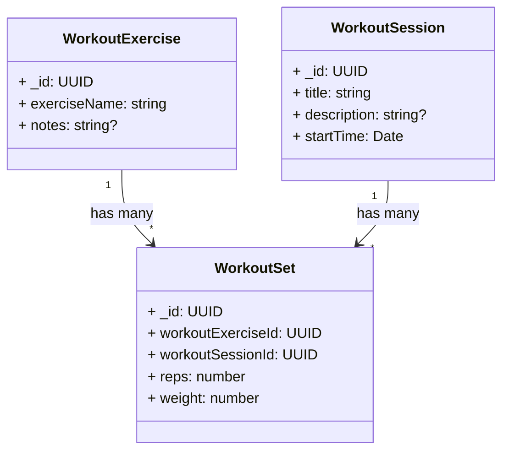

# Dashboard Workouts Domain Model

```mermaid
classDiagram
  class WorkoutSession {
    + _id: UUID
    + title: string
    + description: string?
    + startTime: Date
  }

  class WorkoutExercise {
    + _id: UUID
    + exerciseName: string
    + notes: string?
  }

  class WorkoutSet {
    + _id: UUID
    + workoutExerciseId: UUID
    + workoutSessionId: UUID
    + reps: number
    + weight: number
  }

  %% A WorkoutExercise is now independent from WorkoutSession
  WorkoutExercise "1" --> "*" WorkoutSet : has many
  WorkoutSession "1" --> "*" WorkoutSet : has many
```
