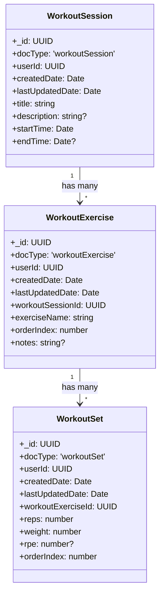

# Dashboard Workouts Domain Model

```mermaid
classDiagram
    class WorkoutSession {
        +_id: UUID
        +docType: 'workoutSession'
        +userId: UUID
        +createdDate: Date
        +lastUpdatedDate: Date
        +title: string
        +description: string?
        +startTime: Date
        +endTime: Date?
    }

    class WorkoutExercise {
        +_id: UUID
        +docType: 'workoutExercise'
        +userId: UUID
        +createdDate: Date
        +lastUpdatedDate: Date
        +workoutSessionId: UUID
        +exerciseName: string
        +orderIndex: number
        +notes: string?
    }

    class WorkoutSet {
        +_id: UUID
        +docType: 'workoutSet'
        +userId: UUID
        +createdDate: Date
        +lastUpdatedDate: Date
        +workoutExerciseId: UUID
        +reps: number
        +weight: number
        +rpe: number?
        +orderIndex: number
    }

    WorkoutSession "1" --> "*" WorkoutExercise : has many
    WorkoutExercise "1" --> "*" WorkoutSet : has many
```
