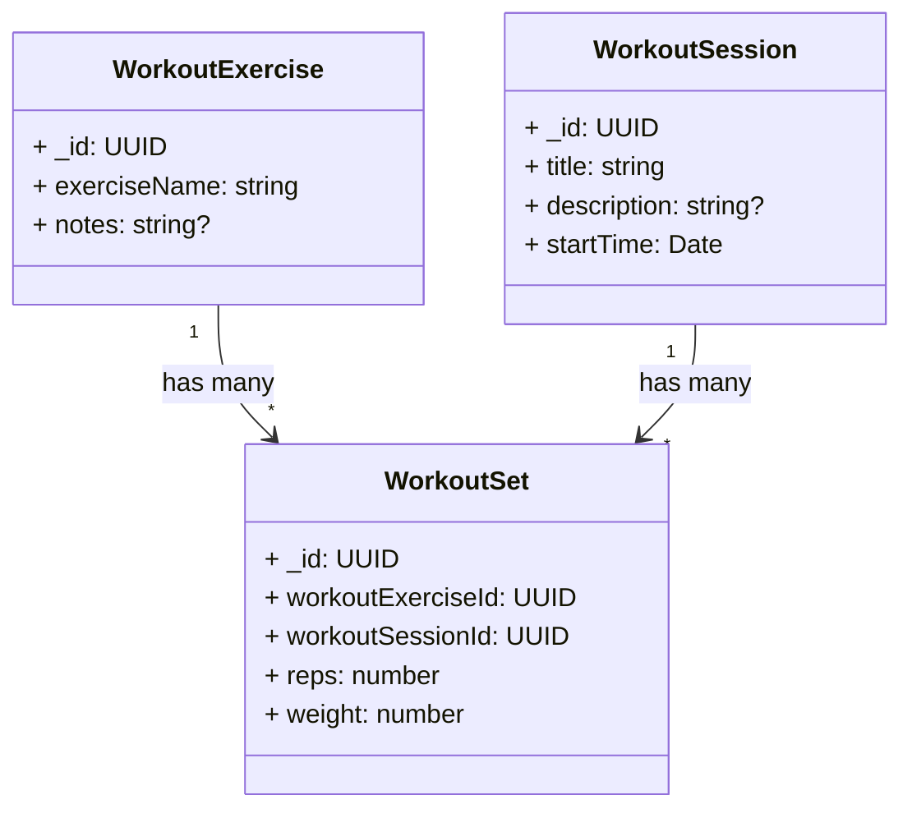

# Dashboard Workouts Domain Model

## Terms

- **Stimulus**: Stimulus is generally the amount of stress we are applying to a muscle over a particular time frame.
- **Maximum Recoverable Volume (MRV)**:
- **Effective Stimulus Range** (pg 28-29): The effective stimulus range is the range between very low stimulus, and just after the amount of stimulus that causes peak muscle growth, just where more stimulus would start resulting in muscle loss.
- **Cell Swelling** (pg 26): "The Pump" 💪
- **Relative Effort** (pg 23): Relative Effort is a measure of how close to failure you are on a lift or how difficult the lift is for you with respect to your current capacity.
- **Reps in Reserve (RIR)** (pg 30): Reps in Reserve are the set's proximity to muscle failure. In other words, how many reps do you have left before you completely fail to produce the movement.

## Key Concepts

### Training Stimulators (pg. 19-20)

The key stimulators at the cellular level that occur in response to training and are predictive of hypertrophy are:

- Tension
- Metabolite Accumulation
- Cell Swelling

During training, and while designing a program, we focus on the following stimulators, in order of importance, in order to cause the above 3 in the optimal way:

1. Tension
2. Volume
3. Relative Effort
4. Range of Motion (ROM)
5. Metabolite Accumulation
6. Cell Swelling
7. Mind-Muscle Connection
8. Movement Velocity
9. Muscle Damage

### Effective Reps (pg. 30-32)

The number of "effective reps" you have done are the number of reps between 5 RIR and 0 RIR. So if you got to 0 RIR, then you did 5 "effective reps". This is not to say that reps before 5 RIR are not useful, they are, just less so.

The catch to this is that lower RIR is much more fatigue, and in the grand scheme of things, always going to 0 RIR can cause muscle loss. So a more balanced average of 2-3 RIR is best.
