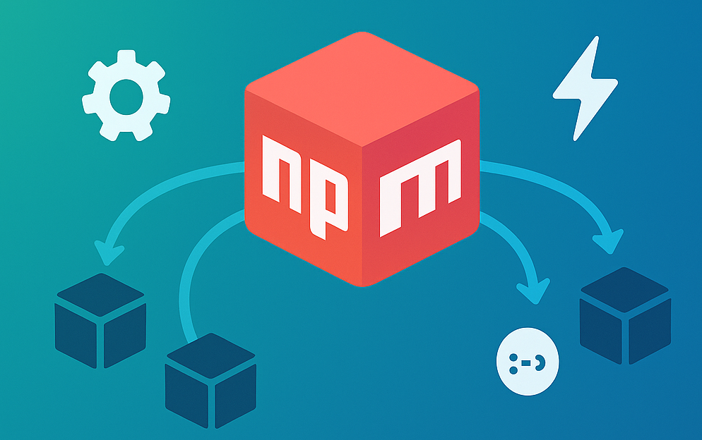

# local-npm-registry

<!--JSR is specifically using an escape character for @ in the URL because only 1 package is published to JSR, where NPM is published to two locations-->

[](https://jsr.io/%40aneuhold/local-npm-registry)
[](https://www.npmjs.com/package/@aneuhold/local-npm-registry)
[](https://github.com/aneuhold/ts-libs/blob/main/LICENSE)

<div align="center">
  <picture>
    
  </picture>
</div>

🚀 **Supercharge your local development workflow!** This CLI tool manages local npm package installations as if they were published, making it effortless to test changes across multiple projects without the hassle of publishing to npm or linking packages manually.

## 📦 Installation

Install as a dev dependency in both your library and consuming projects:

```bash
npm install -D @aneuhold/local-npm-registry
# or
pnpm add -D @aneuhold/local-npm-registry
```

## 🎯 Quick Start

### 1. Set up your library project for development

In your library project (the one you want to test changes from), set up a watch command using nodemon:

```json
{
  "scripts": {
    "dev": "nodemon --ignore lib/ -e ts --exec \"npm run build && local-npm publish\""
  }
}
```

> **💡 Pro tip:** You can pass any [npm publish options](https://docs.npmjs.com/cli/v11/using-npm/config#shorthands-and-other-cli-niceties) to `local-npm publish`. For example, use `local-npm publish --ignore-scripts` if you want to skip pre/post-publish scripts.

Now when you run `npm run dev`, every time you save a TypeScript file, your library will rebuild and automatically update all consuming projects!

### 2. Subscribe your frontend project to the library

In your frontend/consuming project, first install the tool as a dev dependency, then add a convenient script:

```json
{
  "scripts": {
    "sub:my-library": "local-npm subscribe @my-org/my-library",
    "unsub:my-library": "local-npm unsubscribe @my-org/my-library"
  }
}
```

Then subscribe to your library:

```bash
cd my-frontend-project
npm run sub:my-library
```

That's it! Your frontend project will now automatically receive updates whenever you make changes to your library.

## 🛠️ Core Commands

### `local-npm publish [npm-publish-options]`

📤 **Publishes your current package** and automatically updates all projects that are subscribed to it.

- Creates a timestamped version (e.g., `1.2.3-20250528123456`)
- Updates all subscriber projects with the new version
- Perfect for the watch command in your library
- Supports all npm publish options: Pass any [npm publish options](https://docs.npmjs.com/cli/v11/using-npm/config#shorthands-and-other-cli-niceties) directly to the underlying `npm publish` command

<details>
<summary><strong>Examples</strong></summary>

```bash
# Basic publish
local-npm publish

# Publish without running scripts
local-npm publish --ignore-scripts

# Publish with verbose output for debugging
local-npm publish --verbose
```

</details>

### `local-npm subscribe <package-name>`

🔔 **Subscribe to a package** to receive automatic updates when it's published locally.

- Adds your current project as a subscriber
- Installs the latest local version immediately
- Preserves publish arguments: Uses the same npm publish options that were used when the package was originally published
- Great for frontend projects consuming your libraries

### `local-npm unpublish [package-name]`

🗑️ **Removes a package** from the local registry and resets all subscribers to original versions.

- Cleans up when you're done testing
- Resets all consuming projects back to their original package versions

### `local-npm unsubscribe [package-name]`

🔕 **Unsubscribe from packages** and reset to original versions.

- Remove subscription from one package or all packages (if no name provided)
- Resets your project back to the original package versions

## 💡 Why Use This?

✅ **No more `npm link` headaches** - Works reliably across different package managers  
✅ **Automatic updates** - Changes propagate instantly to all consuming projects  
✅ **Clean workflow** - Easy to set up and tear down  
✅ **Version safety** - Always keeps track of original versions to restore  
✅ **Multiple subscribers** - One library can update many consuming projects at once  
✅ **True package installation behavior** - Unlike [local file paths](https://docs.npmjs.com/cli/v11/configuring-npm/package-json#local-paths), this tool installs packages the same way as remote registries, ensuring your local testing matches production behavior

## 🔧 Additional Commands

- `local-npm list` - See all packages in your local registry and their subscribers
- `local-npm get-store` - View the raw local package store data
- `local-npm config` - Show current configuration
- `local-npm init-config` - Create a configuration file
- `local-npm clear-store` - Reset everything and start fresh

## ⚙️ Configuration

The tool can be configured using a `.local-npm-registry.json` file. The configuration file is searched starting from the current working directory and traversing up the directory tree until found.

<details>
<summary><strong>Configuration File Structure</strong></summary>

```json
{
  "dataDirectory": "/path/to/data",
  "registryPort": 4873,
  "registryUrl": "http://localhost:4873",
  "verdaccioConfig": {}
}
```

</details>

<details>
<summary><strong>Configuration Options</strong></summary>

- **`dataDirectory`** (string, optional): The base directory where all local-npm-registry data should be stored. If not specified, defaults to the user's home directory. A `.local-npm-registry` subdirectory will be created within this directory.

- **`registryPort`** (number, optional): The port number for the local Verdaccio registry server. Defaults to `4873`.

- **`registryUrl`** (string, optional): The full URL of the local Verdaccio registry. Defaults to `http://localhost:4873`.

- **`verdaccioConfig`** (object, optional): Custom Verdaccio configuration that will override the default settings. This allows you to customize the registry behavior beyond the basic options.

</details>

<details>
<summary><strong>Creating a Configuration File</strong></summary>

You can create a default configuration file in your project using:

```bash
local-npm init-config
```

This will create a `.local-npm-registry.json` file in the current directory with default values that you can then customize.

</details>

## 📋 Technical Details

### How It Works

This tool uses Verdaccio (a private npm registry) under the hood to simulate publishing packages locally. It maintains a JSON store that tracks package versions and subscriber relationships, ensuring clean workflows and easy cleanup.

> **Note:** Verdaccio is only started for commands that need to publish packages (`publish` and `subscribe`). The `unpublish` and `unsubscribe` commands only modify package.json files and the local store, so they don't require Verdaccio to be running necessarily.

### Why Not Use Local File Paths?

While npm supports [local file paths](https://docs.npmjs.com/cli/v11/configuring-npm/package-json#local-paths) as dependencies (e.g., `"my-package": "file:../my-package"`), this approach has significant limitations:

- **Different installation behavior**: Local paths don't install the package the same way as remote registries do
- **Missing dependency resolution**: The local package's own dependencies aren't automatically installed in the consuming project
- **No build processes**: Pre-publish scripts and build steps are often skipped
- **Inconsistent testing**: Your local testing environment differs from how the package will actually be consumed in production

This tool solves these issues by using a real npm registry (Verdaccio) locally, ensuring that packages are installed, built, and resolved exactly as they would be when published to the public npm registry.

<details>

<summary><code>local-npm publish</code> Command Flow</summary>

<p align="center">
    <a href="https://mermaid.live/edit#pako:eNqNlF1v2jAYhf-K5ZvdQEYCoSSaOrX0a_2gtLSVtmUXJnkhaRM7cpxBR_nve21GEoY2lSuMnnNsn_OaFQ1FBNSns1QswphJRR5OAk7wc_Q9oKkIWdrmeUbycpomRUxgCWGpIAroD9JuH5JjpO6BRSRn4Qubg_VcCE4STsJSSuCKRImEUAn5ioqN8bERDlcBHW80ZCZKHn0O6HoDDDXwNhJv5ATdT6UU0icjsbuF0VSeG8lXKN7IqdYslWSh2ioIZxkQxiPyE2SRCF7pTs1ZzlAyUfryTyAjFoaJIAVIhCvwzIDnCJ4DB8kUEJVkUCiW5Xuu5wa-QPgxjzS6c_JFouJ98aep_HgI1txqEdtyrG7b6Thux3X6ttPtuf3K-8J4f0Hv4zJJq9xJMiMcIII6ky-GvERy_Kc8JRoXlDBPCtXo5dLwV9tCTffkcnI7IgX2BxV3ZbjrvdsRrFu-6u4Nby5k7sph8Z-wro3djUlWEZampCinRSiTKYJYsyQqTortJpXsxshGOEWTBg5LvFM9SaNqkm51xXGJ8ygW_N81j-o5GqPiDHcHFsaNI5Fcimec6EoyNge5q-Oo2Q_FTvPvTeTOON7rIkr9lpDCVEKRZXqEdb57pzHW-p1uaTx43lhX3vfGe4Kx3WBHzajr1CaNEJq_6Bwf3pfjrdnmEeGhyPIUMJa2fsLNanEaS5NYpXowqqdd1dFfE7HR6DGnLTqXSUR9JUto0QxkxvSSrrRdQFUMGZr7-DVi8iWgAV-jJmf8mxDZViZFOY-pP2NpgauN-0nC5pLVCPAI5BD_cRT1DxzPeFB_RZfUtz3X8gau17W9vuN2vX6vRV-p7_Ut2-0NvL7nem5n4LrrFv1ldnWsg27nYODYrt0fdHuevf4NM5DE4A" target="_blank">
        
    </a>
</p>

</details>

<details>

<summary><code>local-npm subscribe <package-name></code> Command Flow</summary>

<p align="center">
    <a href="https://mermaid.live/edit#pako:eNp1k19T2kAUxb_KnX2wL0IRhYTYsaPgPxR0atuZtunDkl3IanY3s7sRW-S792ZjAnWUJxLO_Z27Zw8rkmjGSUTmmV4mKTUOvo5iBfg5_hWTTCc0a6lcgi1mNjFixmEnc4c5TR7ogrcUlXxn4Q6BP_GkcJzF5De0WkdwgsNfOGXgCTC-u5mCddpwFFT4E68brmJyW8GQIayzIFSl_ByTdSUdltLnqX6GEWKvUQX0kYqMzjIOL6tYmBstX3mMvMcpDp0ao00EtZXSDua6UKyRVh4_uH2GM9TfuTKK79wwmiRCg-XmkZtGfebB5yg8565eAVBhhVZvbXLuBy58Kq28mGXCps2c0xunTzPz8WgpXFoBGDghuXVU5jW-YV545iUyjxmDpDCGK1zG6HueuBLa3JmxgIbOszHed-_k0hPHL8eiWfYfYq4NuFTYeu9mbOzHrnDsDCWcJunWXL3Qi3mSFUyoBSi-BK02jCvPuEbGt5xRx7cIHxrH9r3VapPQ-9Fce9qkjLtQ2ChU4WESLSVVzDfs7f3KptdqPEq-9dywJ549xeJOMLvthDaNnW7adLX9puzwTVmvtHDA9FK9X7Ebb3OL4qGWecYxkhYcv7qSwmdVtpjskoURjETOFHyXSG4kLR_JqsTFxKVcYtoRfmXUPMQkVmucyan6qbWsx4wuFimJ5jSz-FTRR4IuDJXNW2wZ42aI_x5HoqB_4CEkWpEnEnU7--2wH3YHwd7goLcf7uOvf0i01-m2w14nGHR7QdALO_1wvUv-et9uu9PvdnphGOyFYe-gH4Trf1CQe58" target="_blank">
        
    </a>
</p>

</details>

<details>

<summary><code>local-npm unpublish &lt;package-name&gt;</code> Command Flow</summary>

<p align="center">
    <a href="https://mermaid.live/edit#pako:eNqNU01T2zAU_CsaXXpJ0oTEwfZ06JQAKQTCV3to6x4UW8QCS_JIMoSG_Pc-ybXswnSmOUXy7r59-562OJUZxTG-K-RTmhNl0JejRCD4ffqR4EKmpOiLkqNKlNWqYDpHdEPTytAswT9Rv3-ADgF3Q0mGSpI-kDUd3GspEBMorZSiwqCMKZoaqZ6BUUsfOuJsm-CrmoPuZCWyjwne1YCZBbws5Qs6AvVjpaSK0VL-XcJxvGZN-Ub1Czq2nI1RJDUNAwnCqcceu_onjXHXJTq7vVwiDT5b3InDzTs-6YZpo213Dtk6nnvHn1vHDUtIYyl1HUXXoNFJY946PwXunBokFVszAeBHqjSzvSrJX5k7debO_jBIUSBdrXSq2Ao4EI5CJme6CcDTzhxtAT3dduCur7abRWvpHAqcgBglad6pgEol72GsXnfhA7hwuWow1WxAd2wfVur9gZFvWvRC587gEkS-lhkxtFP0nf4vKfTETC4rgwzjVBvCSy--dOKX1mFllxS-QnCp5JyIzI31TYeuin0CDRrCKDtnr33ptK8g2QuYU3cabbBXnWC7Ny63-uLCyVy7ELl8pH6FIUn1XG_CPzf22pFvgDyTvCwoxNf3a-jfMM1cU7bl13uj7OBADvfwWrEMx0ZVtIc5VZzYI97aQgk2ObUPKoa_GVEPCU7EDjglEd-l5A1NyWqd4_iOFBpOlZvnESNrRbi_hQ3JqJrBYzY4DsdjJ4LjLd7geBKEg2A63B-OxqP9cBJGQQ8_43gcDKIwiqZBFE7D0XCyt-vhX67s3mAvGo-CYDQNgmgYTaPJ7jfaNJSB" target="_blank">
        
    </a>
</p>

</details>
<details>

<summary><code>local-npm unsubscribe [&lt;package-name&gt;]</code> Command Flow</summary>

<p align="center">
    <a href="https://mermaid.live/edit#pako:eNq1VFlP4zAQ_isjI8FL2yWkV9IVK2gpLEc5y17ZB5O4TSCxI8fh2NL_vhMXnECR0Epsn2prvvmOmXhGfBEw4pJJLO78kEoFFwOPA_62fnkkFj6N6zxNIOdZfpX5MrpisLriWL3VWPVS6t_QKatzmrDVqeqtOHYP2D3zc8UCj_yGen0TtmceOVkUQlEIqRS3UcCCLx6ZL6i2i8LHkXiEPpKeMRqAZob98-MRZEpIht2qtT9Y9giDd4v7WsEO1g0jHgCNY3jSnMFdyCQDP5eScVWIuma--nwlP21GGVAwdqXpNtDdhhU_7D7KVAYRX_CWjobG0S6S70gppAsmBaFgInIU9Aw0FDuaYg8ptvhDqSEwskuKPUPxFSlGonSmxItxTaRIDMFeGd9-EYuQwKgfvkFlIMMScoCQfsj8G4gmr6MDjO2N0A60o0N01H9VX1KWpg6NqaMyt5GoFhf2VIhkr3UeljpHejMScbs0YJ2GnvITfK2qOoMYB2o67mvtx9hslykQMppGHBftFgsjwXGGcknEsYacIGScBlQt8a8Z3Y3rTHCtBA0t9b6LVChyBSpKWKZokhqGE81w-jEOT3WzM5zOEa7hixXCdj7LKgt3Vlmd6k0xrfNCTs5xoVEsfmW-SBK6WPC3vrDiRXkuLUKsnI20kZZ28S_hX2jI-D-GP9YMlx_v9lw3_lZ8XyJJY4bi6zDmlbUvxvriBTPYS439_h62TIvUyFRGAXGVzFmNJEwmtDiSWdHQIypkCda5-Deg8sYjHp8jJqX8pxDJM0yKfBoSd0LjDE-5TnwQ0amkibnFLAIm-_jYKeI6lu5B3Bm5J65lNyyr2Wl2NlrN9ZbT6bRq5AGvu81G13aanXbLWe9adrs9r5E_mtZqOJbVtTsbjt1u2W3H6s7_AllxOBA" target="_blank">
        
    </a>
</p>

</details>

### Local JSON Store Structure

The local JSON store maintains the following structure:

```json
{
  "packages": {
    "@aneuhold/core-ts-lib": {
      "originalVersion": "1.2.3",
      "currentVersion": "1.2.3-20250526123456",
      "subscribers": [
        {
          "subscriberPath": "/path/to/consumer-project-1",
          "originalSpecifier": "^1.2.3"
        },
        {
          "subscriberPath": "/path/to/consumer-project-2",
          "originalSpecifier": "~1.2.0"
        }
      ],
      "packageRootPath": "/path/to/core-ts-lib",
      "publishArgs": ["--ignore-scripts", "--verbose"]
    },
    "@aneuhold/be-ts-lib": {
      "originalVersion": "2.1.0",
      "currentVersion": "2.1.0-20250526134567",
      "subscribers": [
        {
          "subscriberPath": "/path/to/consumer-project-3",
          "originalSpecifier": "^2.1.0"
        }
      ],
      "packageRootPath": "/path/to/be-ts-lib"
    }
  }
}
```
