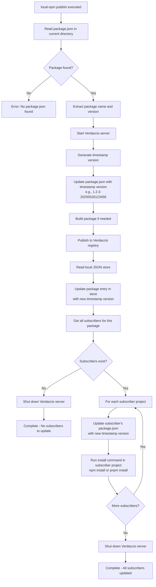
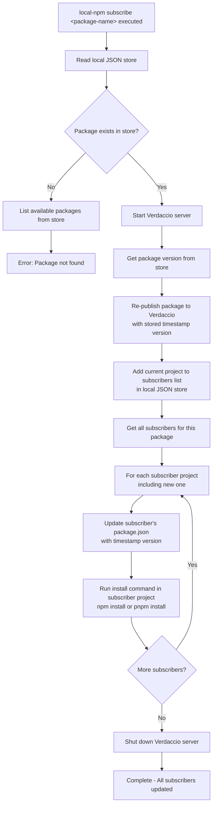
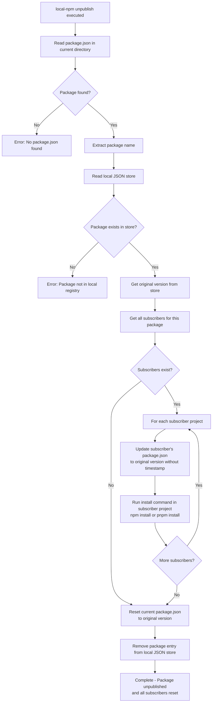

```mermaid
flowchart TD
    A["local-npm unsubscribe &#91;&lt;package-name&gt;&#93; executed"] --> B{"Package name provided?"}
    B -->|No| C["Read local JSON store"]
    B -->|Yes| D["Read local JSON store"]
    C --> E["Find all packages where current project<br/>is a subscriber"]
    D --> F{"Package exists in store?"}
    F -->|No| G["Error: Package not found in store"]
    E --> H{"Any subscribed packages?"}
    H -->|No| I["No packages to unsubscribe from"]
    H -->|Yes| J["For each subscribed package"]
    F -->|Yes| K["Check if current project is subscriber"]
    K --> L{"Current project subscribed?"}
    L -->|No| M["Error: Not subscribed to this package"]
    L -->|Yes| N["Remove current project from<br/>package's subscribers list"]
    J --> O["Get original version for package"]
    O --> P["Update current project's package.json<br/>to original version without timestamp"]
    P --> Q["Remove current project from<br/>package's subscribers list"]
    Q --> R{"More packages to process?"}
    R -->|Yes| J
    R -->|No| S["Run install command in current project<br/>npm install or pnpm install"]
    N --> T["Get original version for package"]
    T --> U["Update current project's package.json<br/>to original version without timestamp"]
    U --> V["Run install command in current project<br/>npm install or pnpm install"]
    S --> W["Complete - Unsubscribed from all packages"]
    V --> X["Complete - Unsubscribed from package"]
```

# local-npm-registry

[](https://jsr.io/@aneuhold/local-npm-registry)
[](https://www.npmjs.com/package/@aneuhold/local-npm-registry)
[](https://github.com/aneuhold/ts-libs/blob/main/LICENSE)

🚀 **Supercharge your local development workflow!** This CLI tool manages local npm package installations as if they were published, making it effortless to test changes across multiple projects without the hassle of publishing to npm or linking packages manually.

## 📦 Installation

Install as a dev dependency in both your library and consuming projects:

```bash
npm install -D @aneuhold/local-npm-registry
# or
pnpm add -D @aneuhold/local-npm-registry
```

## 🎯 Quick Start

### 1. Set up your library project for development

In your library project (the one you want to test changes from), set up a watch command using nodemon:

```json
{
  "scripts": {
    "dev": "nodemon --ignore lib/ -e ts --exec \"npm run build && local-npm publish\""
  }
}
```

Now when you run `npm run dev`, every time you save a TypeScript file, your library will rebuild and automatically update all consuming projects!

### 2. Subscribe your frontend project to the library

In your frontend/consuming project, first install the tool as a dev dependency, then add a convenient script:

```json
{
  "scripts": {
    "sub:my-library": "local-npm subscribe @my-org/my-library",
    "unsub:my-library": "local-npm unsubscribe @my-org/my-library"
  }
}
```

Then subscribe to your library:

```bash
cd my-frontend-project
npm run sub:my-library
```

That's it! Your frontend project will now automatically receive updates whenever you make changes to your library.

## 🛠️ Core Commands

### `local-npm publish`

📤 **Publishes your current package** and automatically updates all projects that are subscribed to it.

- Creates a timestamped version (e.g., `1.2.3-20250528123456`)
- Updates all subscriber projects with the new version
- Perfect for the watch command in your library

### `local-npm subscribe <package-name>`

🔔 **Subscribe to a package** to receive automatic updates when it's published locally.

- Adds your current project as a subscriber
- Installs the latest local version immediately
- Great for frontend projects consuming your libraries

### `local-npm unpublish [package-name]`

🗑️ **Removes a package** from the local registry and resets all subscribers to original versions.

- Cleans up when you're done testing
- Resets all consuming projects back to their original package versions

### `local-npm unsubscribe [package-name]`

🔕 **Unsubscribe from packages** and reset to original versions.

- Remove subscription from one package or all packages (if no name provided)
- Resets your project back to the original package versions

## 💡 Why Use This?

✅ **No more `npm link` headaches** - Works reliably across different package managers  
✅ **Automatic updates** - Changes propagate instantly to all consuming projects  
✅ **Clean workflow** - Easy to set up and tear down  
✅ **Version safety** - Always keeps track of original versions to restore  
✅ **Multiple subscribers** - One library can update many consuming projects at once  
✅ **True package installation behavior** - Unlike [local file paths](https://docs.npmjs.com/cli/v11/configuring-npm/package-json#local-paths), this tool installs packages the same way as remote registries, ensuring your local testing matches production behavior

## 🔧 Additional Commands

- `local-npm list` - See all packages in your local registry and their subscribers
- `local-npm get-store` - View the raw local package store data
- `local-npm config` - Show current configuration
- `local-npm init-config` - Create a configuration file
- `local-npm clear-store` - Reset everything and start fresh

## 📋 Technical Details

### How It Works

This tool uses Verdaccio (a private npm registry) under the hood to simulate publishing packages locally. It maintains a JSON store that tracks package versions and subscriber relationships, ensuring clean workflows and easy cleanup.

> **Note:** Verdaccio is only started for commands that need to publish packages (`publish` and `subscribe`). The `unpublish` and `unsubscribe` commands only modify package.json files and the local store, so they don't require Verdaccio to be running necessarily.

### Why Not Use Local File Paths?

While npm supports [local file paths](https://docs.npmjs.com/cli/v11/configuring-npm/package-json#local-paths) as dependencies (e.g., `"my-package": "file:../my-package"`), this approach has significant limitations:

- **Different installation behavior**: Local paths don't install the package the same way as remote registries do
- **Missing dependency resolution**: The local package's own dependencies aren't automatically installed in the consuming project
- **No build processes**: Pre-publish scripts and build steps are often skipped
- **Inconsistent testing**: Your local testing environment differs from how the package will actually be consumed in production

This tool solves these issues by using a real npm registry (Verdaccio) locally, ensuring that packages are installed, built, and resolved exactly as they would be when published to the public npm registry.

<details>

<summary><code>local-npm publish</code> Command Flow</summary>



</details>

<details>

<summary><code>local-npm subscribe <package-name></code> Command Flow</summary>



</details>

<details>

<summary><code>local-npm unpublish &lt;package-name&gt;</code> Command Flow</summary>



</details>
<details>

<summary><code>local-npm unsubscribe [&lt;package-name&gt;]</code> Command Flow</summary>



</details>

### Local JSON Store Structure

The local JSON store maintains the following structure:

```json
{
  "packages": {
    "@aneuhold/core-ts-lib": {
      "originalVersion": "1.2.3",
      "currentVersion": "1.2.3-20250526123456",
      "subscribers": [
        "/path/to/consumer-project-1",
        "/path/to/consumer-project-2"
      ],
      "packageRootPath": "/path/to/core-ts-lib"
    },
    "@aneuhold/be-ts-lib": {
      "originalVersion": "2.1.0",
      "currentVersion": "2.1.0-20250526134567",
      "subscribers": ["/path/to/consumer-project-3"],
      "packageRootPath": "/path/to/be-ts-lib"
    }
  }
}
```
