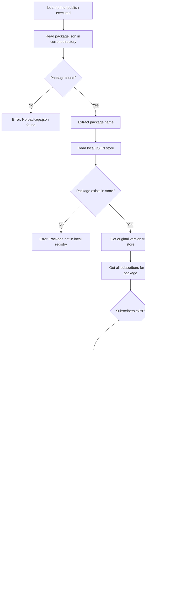

# local-npm-registry

Functionality to manage local package installations and updates.

### Detailed Command Flowcharts

> **Note:** Verdaccio is only started for commands that need to publish packages (`publish` and `subscribe`). The `unpublish` and `unsubscribe` commands only modify package.json files and the local store, so they don't require Verdaccio to be running.

<details>

<summary><code>local-npm publish</code> Command Flow</summary>


</details>

<details>

<summary><code>local-npm subscribe <package-name></code> Command Flow</summary>


</details>

<details>

<summary><code>local-npm unpublish &lt;package-name&gt;</code> Command Flow</summary>



</details>
<details>

<summary><code>local-npm unsubscribe [&lt;package-name&gt;]</code> Command Flow</summary>


</details>

## Local JSON Store Structure

The local JSON store maintains the following structure:

```json
{
  "packages": {
    "@aneuhold/core-ts-lib": {
      "originalVersion": "1.2.3",
      "currentVersion": "1.2.3-20250526123456",
      "subscribers": [
        "/path/to/consumer-project-1",
        "/path/to/consumer-project-2"
      ]
    },
    "@aneuhold/be-ts-lib": {
      "originalVersion": "2.1.0",
      "currentVersion": "2.1.0-20250526134567",
      "subscribers": ["/path/to/consumer-project-3"]
    }
  }
}
```
